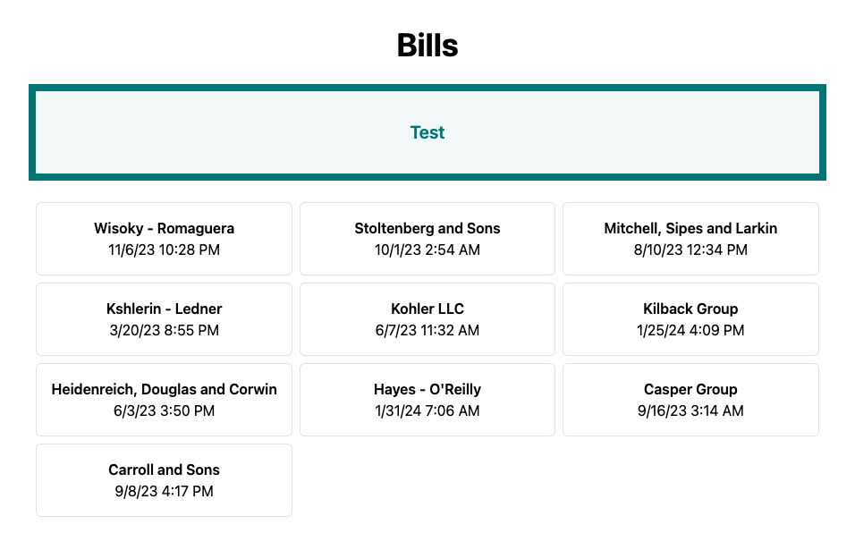

## 0.13.0 (2024-02-15)

### 🚀 Features

- **bills:** increment value ([4d5f520](https://github.com/jasonruesch/bills/commit/4d5f520))

## 0.12.0 (2024-02-15)

### 🚀 Features

- **bills:** increment value ([b28a8c4](https://github.com/jasonruesch/bills/commit/b28a8c4))

## 0.11.0 (2024-02-15)

### 🚀 Features

- **bills:** remove bg opacity ([a448734](https://github.com/jasonruesch/bills/commit/a448734))

## 0.10.0 (2024-02-15)

### 🚀 Features

- **bills:** increment border opacity ([cff8589](https://github.com/jasonruesch/bills/commit/cff8589))

## 0.9.0 (2024-02-15)

### 🚀 Features

- **bills:** increment border opacity ([f48e473](https://github.com/jasonruesch/bills/commit/f48e473))

## 0.6.0 (2024-02-14)

### 🚀 Features

- **bills:** change border color opacity ([73138dc](https://github.com/jasonruesch/bills/commit/73138dc))

## 0.5.2 (2024-02-14)

### 🩹 Fixes

- **bills:** set opacity of borders to 50

### ❤️  Thank You

- Jason Ruesch

# Bills Changelog

## 0.5.1 (2024-02-14)

### 🩹 Fixes

- **bills:** use test color for bill list borders

### ❤️  Thank You

- Jason Ruesch

## 0.5.0 (2024-02-14)

### 🚀 Features

- **bills:** add bill list to app

### ❤️  Thank You

- Jason Ruesch

## 0.4.0 (2024-02-14)

### 🚀 Features

- **bills:** update bg opacity to 5

### ❤️  Thank You

- Jason Ruesch

## 0.3.1 (2024-02-14)

### 🩹 Fixes

- **bills:** update bg color from 10 to 20 opacity

### ❤️  Thank You

- Jason Ruesch

## 0.3.0 (2024-02-14)

### 🚀 Features

- **bills:** use test color for background of box

### ❤️  Thank You

- Jason Ruesch

## 0.2.0 (2024-02-13)

### 🚀 Features

- **bills:** display test color box

### ❤️  Thank You

- Jason Ruesch

## 0.1.1 (2024-02-12)

### 🩹 Fixes

- **bills:** use test color

### ❤️  Thank You

- Jason Ruesch